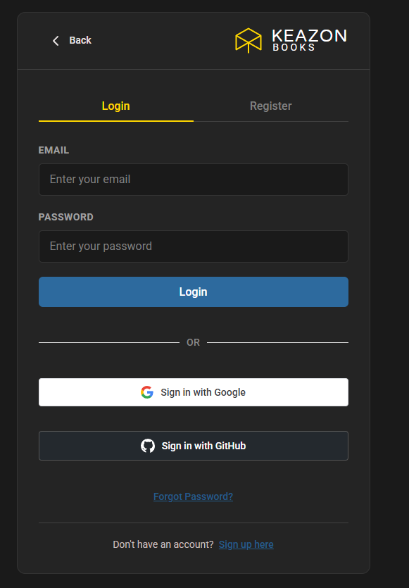
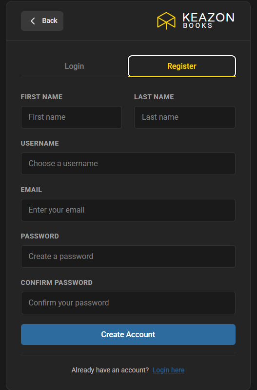
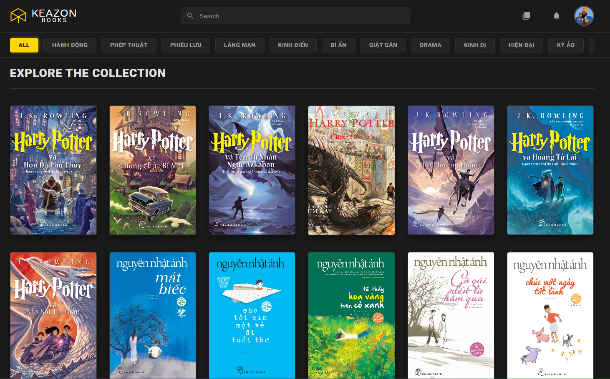
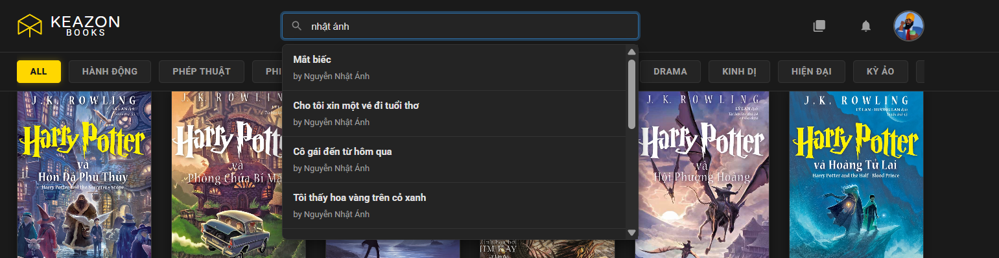
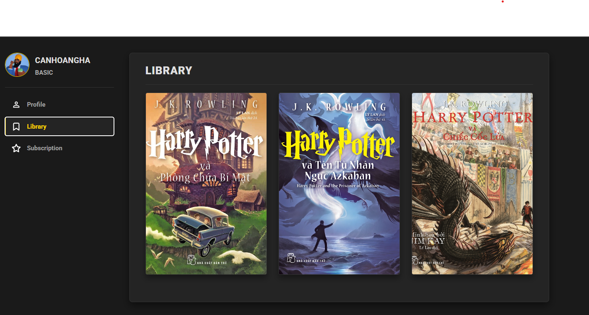
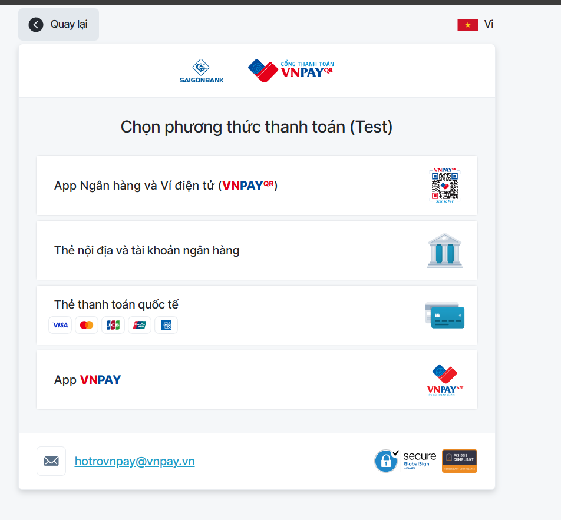

# 📚 eLibrary - Electronic Library System

<div align="center">


</div>


The eLibrary project is a modern electronic library management system that allows users to read books online, borrow books, rate books, and manage subscription plans.

The backend is built with Spring Boot following a modular architecture and is integrated with MySQL, Redis, and Elasticsearch for data persistence, caching, and search functionality.  
The frontend is developed using React, providing a responsive and intuitive user interface for end users.


## 🎯 Key Features

### Book Management

* Search books using Elasticsearch
* View book details
* Filter books by category and language
* Rate and review books
* View new arrivals

### User Management

* Registration/Login
* Email verification with OTP
* OAuth2 (Google, GitHub)
* Profile management
* Forgot password

### Borrowing

* Borrow books online
* Renew loan periods
* Automatic overdue checks

### Subscription Plans

* View subscription plans
* Subscribe via VNPay
* Manage user subscriptions
* Automatic renewal/cancellation

### Payment

* VNPay integration
* Payment callback handling
* Payment history

## 📸 Screenshots

### 🔐 Authentication

<table align="center">
  <tr>
    <td align="center">
      <br/>
      <b>Login</b>
    </td>
    <td align="center">
      <br/>
      <b>Register</b>
    </td>
  </tr>
</table>

---

### 📚 Library Browsing

<p align="center">
  
  <br/>
  <i>Browse Library (Home)</i>
</p>

<p align="center">
  
  <br/>
  <i>Search Books with Elasticsearch</i>
</p>

<p align="center">
  
  <br/>
  <i>View Book Details</i>
</p>

---

### 📖 Borrowing Flow

<p align="center">
  
  <br/>
  <i>Borrowing Process</i>
</p>

<p align="center">
  
  <br/>
  <i>View Borrowed Books</i>
</p>

---

### 👤 User & Subscription

<table align="center">
  <tr>
    <td align="center">
      <br/>
      <b>Subscription Plans</b>
    </td>
    <td align="center">
      <br/>
      <b>VNPay Payment</b>
    </td>
  </tr>
</table>


## 🛠️ Technologies Used

### Backend

* **Framework**: Spring Boot 3.5.5
* **Java**: 21
* **Database**: MySQL 8.1.0
* **Cache**: Redis
* **Search Engine**: Elasticsearch 8.15.3
* **ORM**: Spring Data JPA / Hibernate
* **Security**: Spring Security, OAuth2, JWT
* **API Documentation**: SpringDoc OpenAPI (Swagger)
* **Mapping**: MapStruct
* **Build Tool**: Maven
* **Email**: Spring Mail
* **Payment**: VNPay Integration

### Frontend

* **Framework**: React 19.1.1
* **Build Tool**: Vite 7.1.7
* **Routing**: React Router DOM 7.9.3
* **Testing**: Vitest 4.0.8, React Testing Library
* **Linting**: ESLint
* **Infinite Scroll**: react-infinite-scroll-component

### DevOps

* **Containerization**: Docker, Docker Compose
* **Web Server**: Nginx (for frontend)

## 📁 Project Structure

```
Doancnpm/
├── eLibrary_service/           # Backend Spring Boot
│   ├── src/
│   │   ├── main/
│   │   │   ├── java/com/cnpm/eLibrary_service/
│   │   │   │   ├── configuration/    # Configuration (Security, OAuth2, JWT)
│   │   │   │   ├── controller/       # REST Controllers
│   │   │   │   ├── dto/              # Data Transfer Objects
│   │   │   │   ├── entity/           # JPA Entities
│   │   │   │   ├── es_document/      # Elasticsearch Documents
│   │   │   │   ├── es_repository/    # Elasticsearch Repositories
│   │   │   │   ├── exception/        # Exception Handling
│   │   │   │   ├── mapper/           # MapStruct Mappers
│   │   │   │   ├── repository/       # JPA Repositories
│   │   │   │   ├── scheduler/        # Scheduled Tasks
│   │   │   │   ├── service/          # Business Logic
│   │   │   │   └── util/             # Utilities
│   │   │   └── resources/
│   │   │       └── application.yml   # Application Configuration
│   │   └── test/                     # Unit Tests
│   ├── docker/
│   │   └── mysql/
│   │       └── init.sql              # Database Initialization
│   ├── dockerfile                    # Dockerfile for backend
│   ├── docker-compose.yml            # Docker Compose for backend
│   └── pom.xml                       # Maven Dependencies
│
├── eLibrary_UI/                      # Frontend React
│   ├── src/
│   │   ├── components/               # React Components
│   │   │   ├── AuthForm/             # Authentication Forms
│   │   │   ├── Book/                 # Book Components
│   │   │   ├── Home/                 # Home Components
│   │   │   └── UserProfile/          # User Profile Components
│   │   ├── pages/                    # Page Components
│   │   ├── utils/                    # Utility Components
│   │   ├── verification/             # OAuth & Payment Pages
│   │   └── test/                     # Test Files
│   ├── dockerfile                    # Dockerfile for frontend
│   ├── nginx.conf                    # Nginx Configuration
│   ├── vite.config.js                # Vite Configuration
│   └── package.json                  # NPM Dependencies
│
├── docker-compose.yml                # Main Docker Compose (all services)
└── README.md                         # This file
```

## 📋 System Requirements

* **Java**: JDK 21 or higher
* **Node.js**: 18.x or higher
* **Maven**: 3.8+ (or use Maven Wrapper)
* **Docker**: 20.10+ and Docker Compose 2.0+
* **MySQL**: 8.1.0+ (or use Docker)
* **Redis**: Latest (or use Docker)
* **Elasticsearch**: 8.15.3+ (or use Docker)

## 🚀 Installation and Setup

### Method 1: Running with Docker Compose (Recommended)

1. **Clone the repository**

```bash
git clone <repository-url>
cd Doancnpm
```

2. **Create `.env` file for backend**

```bash
cd eLibrary_service
# Create .env file with necessary environment variables (see Environment Variables section)
```

3. **Run all services with Docker Compose**

```bash
cd ..
docker-compose up -d
```

**Services status:**

* **Frontend (Web UI)**: `http://localhost:5173`
* **API Documentation (Swagger)**: `http://localhost:8080/swagger-ui.html`
* **Backend Server**: Running on port `8080`


**Check logs**

```bash
docker-compose logs -f
```

### Method 2: Manual Setup (Development)

#### Backend

1. **Install MySQL, Redis, Elasticsearch**
* Or run only these services with Docker:

```bash
docker-compose up -d elibrary-db elibrary-redis elibrary-es
```


2. **Configure `.env` file**
```bash
cd eLibrary_service
# Create .env file with environment variables
```


3. **Run Spring Boot**
```bash
# Using Maven Wrapper
./mvnw spring-boot:run

# Or using Maven
mvn spring-boot:run
```


#### Frontend

1. **Install dependencies**
```bash
cd eLibrary_UI
npm install
```


2. **Run development server**
```bash
npm run dev
```


3. **Build for production**
```bash
npm run build
```


## 🔧 Environment Variables

Create a `.env` file in the `eLibrary_service/` directory with the following variables:

```env
# JWT
JWT_SIGNER_KEY=your-secret-key-here-minimum-256-bits

# Email (Gmail)
MAIL_USERNAME=your-email@gmail.com
MAIL_PASSWORD=your-app-password

# OAuth2 - Google
GOOGLE_CLIENT_ID=your-google-client-id
GOOGLE_CLIENT_SECRET=your-google-client-secret

# OAuth2 - GitHub
GITHUB_CLIENT_ID=your-github-client-id
GITHUB_CLIENT_SECRET=your-github-client-secret

# VNPay
VNPAY_TMN_CODE=your-tmn-code
VNPAY_HASH_SECRET=your-hash-secret
```

## 🧪 Testing

### Backend Tests

```bash
cd eLibrary_service
./mvnw test
```

### Frontend Tests

```bash
cd eLibrary_UI
npm test              # Run tests once
npm run test:watch    # Run tests in watch mode
npm run test:ui       # Run tests with UI
```

## 📦 Main API Endpoints

All backend APIs are prefixed with **`/api`** and documented using **Swagger (OpenAPI)**.

### 🔐 Authentication & Authorization

The system supports JWT-based authentication and OAuth2 login.

* User login, logout, and token refresh
* Token introspection
* Email-based password recovery (OTP & reset link)
* OAuth2 registration completion (Google, GitHub)

Main endpoints:

* `/auth/login`
* `/auth/logout`
* `/auth/refresh`
* `/auth/forgot-password`
* `/auth/reset-password`
* `/auth/complete-oauth-register`

---

### 👤 User Management & Verification

User accounts are fully managed with role-based access control and email verification.

* User CRUD operations
* Get current logged-in user information
* Email verification via OTP
* Resend verification email
* Update user email before verification

Main endpoints:

* `/user`
* `/user/{id}`
* `/user/my-info`
* `/verify/email`
* `/verify/otp/ttl`

---

### 📚 Book Management

Books are managed and indexed using **Elasticsearch** for fast searching and filtering.

* Create, update, delete books
* View book details and new arrivals
* Full-text search with Elasticsearch
* Filter books by category
* Upload book covers

Main endpoints:

* `/book`
* `/book/{id}`
* `/book/new`
* `/book/search`
* `/book/filter`
* `/book/upload/{id}`

---

### 🏷️ Category Management

Categories are used to organize books in the library.

* Create, update, delete categories
* View all available categories

Main endpoints:

* `/category`
* `/category/{id}`

---

### ⭐ Book Rating

Users can rate books and update or remove their ratings.

* Rate a book
* Remove a rating

Main endpoints:

* `/rating/{userId}/{bookId}`

---

### 📖 Borrowing System

The borrowing module allows users to borrow and manage book loans.

* Borrow books online
* Renew borrowing period
* Return borrowed books
* View borrowing history

Main endpoints:

* `/borrow`
* `/borrow/{id}/renew`
* `/borrow/{id}/return`
* `/borrow/user/{userId}`

---

### 💳 Payment (VNPay Integration)

VNPay is integrated to handle subscription payments securely.

* Create VNPay payment requests
* Handle VNPay callback responses

Main endpoints:

* `/payment/create-payment`
* `/payment/vnpay-callback`

---

### 📦 Subscription Management

The system supports paid subscription plans for enhanced access.

* View available subscription plans
* Subscribe or cancel a subscription
* Manage user subscriptions

Main endpoints:

* `/subscription-plan`
* `/subscription-plan/{id}`
* `/subscriptions/subscribe`
* `/subscriptions/cancel/{userId}`
* `/subscriptions/user/{userId}`

---

## 📚 API Documentation

After running the backend, access Swagger UI at:

* **Swagger UI**: http://localhost:8080/swagger-ui.html
* **API Docs (JSON)**: http://localhost:8080/v3/api-docs
  
## 🔐 Security

* JWT Authentication with access token and refresh token
* OAuth2 with Google and GitHub
* Spring Security for authentication and authorization
* Password encryption with BCrypt
* CORS configuration
* Email verification with OTP

## 📝 Notes

* Ensure services (MySQL, Redis, Elasticsearch) are running before starting the backend.
* Make sure environment variables are correctly configured in the `.env` file.
* VNPay requires IPN URL configuration (can use ngrok for development).
* Elasticsearch needs time to start up; wait a few seconds after the container starts.

## 📄 License

This project is developed for educational purposes and personal portfolio demonstration.

## 👤 Contributors & Role

### Can Hoang Ha – Backend Developer
- Designed and implemented a **modular backend architecture** using **Spring Boot**
- Developed **RESTful APIs** for authentication, book management, borrowing, subscriptions, and payments
- Integrated **MySQL**, **Redis**, and **Elasticsearch**
- Implemented **JWT-based authentication**, **OAuth2 (Google, GitHub)**, and role-based access control
- Integrated **VNPay** payment workflow and callback handling
- Wrote **unit tests and integration tests** for backend services and controllers
- Documented APIs using **Swagger (OpenAPI)**

### Team Context
- **Nguyen Vu Hoang** – Frontend development 
- **Doan Minh Duc** – Frontend testing
- **Ngo Van Hiep** - Documentation & Analysis
- **Le Vu Minh Hieu** – Documentation & Analysis
